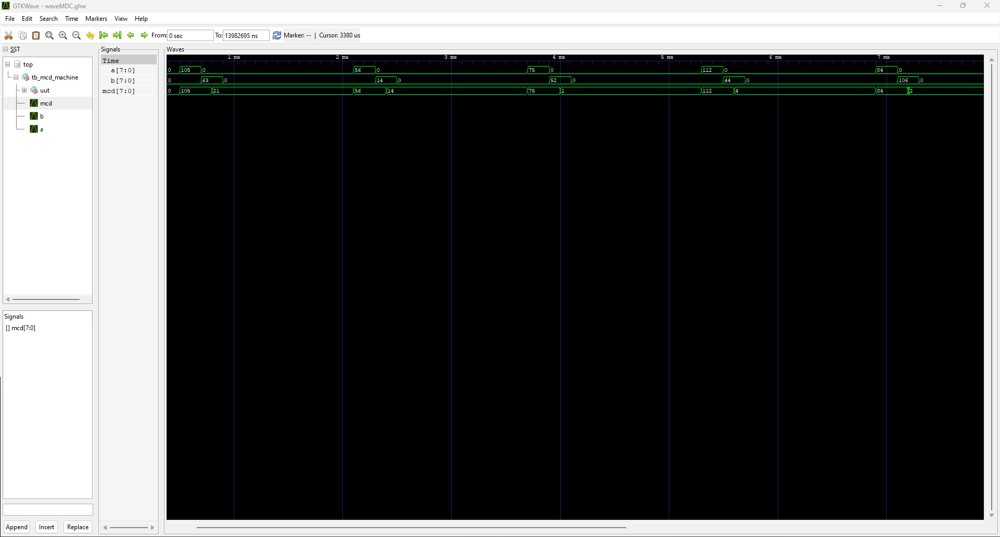
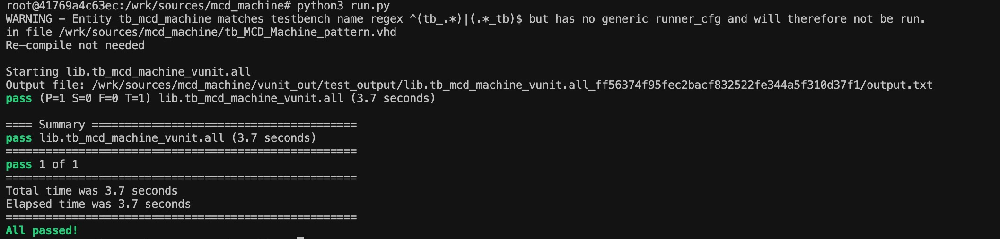
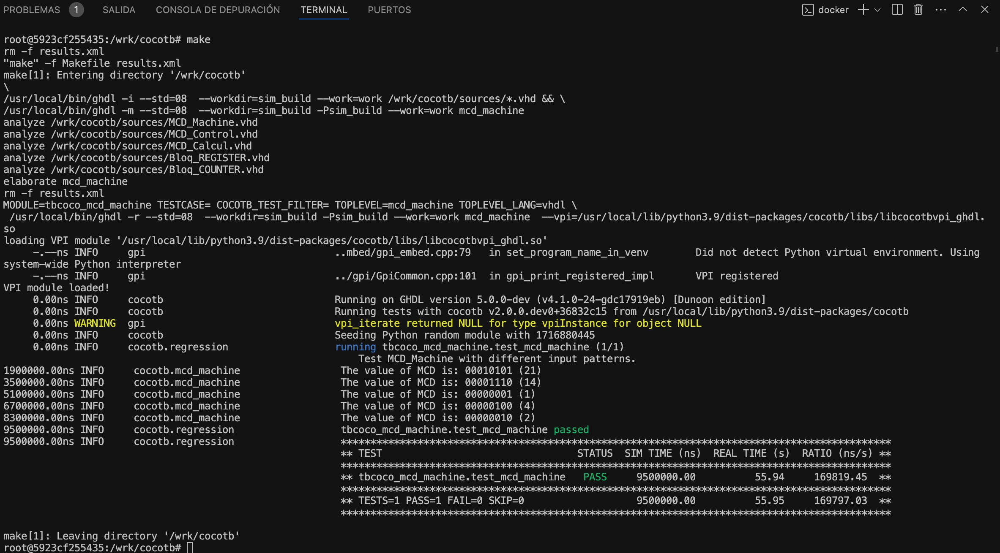

# GHDL_tutorial_repo

Este repositorio contiene todas los archivos y directorios que se han generado testeando las herramientas.

## Contexto

Para mantener un entorno de trabajo más ordenado se ha decidido preparar este breve repositorio en el cual se encuentran todos los archivos y carpetas que se han generado testando las herramientas. Las librerías que se han usado han sido `ghdl`, `gtkwave`, `vunit` y `cocotb`.

Se ha partido de diseños VHDL que se habían preparado para otras asignaturas y se han modificado para utilizar las herramientas mencionadas anteriormente. El diseño que se ha elegido es una máquina que computa el máximo común divisor (MCD). Se ha elegido este diseño porque es fácil de testear y tiene cierta complejidad dado que tiene componentes que son interdependientes.

Para tener más limpieza en el repositorio, en el gitignore se han añadido todos los ficheros y directorios que se generan automáticamente con cada ejecución. Por lo tanto, no habrá ficheros de resultados ni *outputs* de ejecuciones. Todos los ficheros que se han utilizado para GHDL, GtkWave y VUnit se encuentran en el directorio `sources/mcd_machine/`, mientras que los ficheros que se han usado para cocotb se encuentran en el directorio `cocotb/`. `original_sources/` contiene los ficheros originales de los que se ha partido y `testbenches/` es un directorio pensado solo para almacenar los tb que se han preparado (no para ejecutarlos).

## Herramientas integradas en HDL
Primero se han probado las herramientas que se integran directamente con HDL, sin recurrir (o mínimamente )a escribir código en otros lenguajes. Estas son, **GHDL, GtkWave** y **VUnit**.

### GHDL

GHDL es una herramienta de compilación, elaboración y simulación de ficheros escritos en HDL (ya sea VHDL o SystemVerilog). Por lo tanto, para probar sus capacidades se ha modificado el diseño inicial que se tenía y se ha añadido un tb en el que se prueban varias parejas de números para encontrar el MCD en cada caso.

Para preparar el diseño se han seguido las indicaciones de la guía de usuario de GHDL. Como es un diseño compuesto de varios componentes, se le tienen que indicar todos a GHDL para que los tenga en cuenta cuando haga la compilación. Por ello, primero se crea un *working directory* y se añaden todos los ficheros vhd a ese working directory. Todos estos ficheros se encuentran en el directorio `sources/mcd_machine`.

    mkdir work
    ghdl -i --workdir=work *.vhd

Una vez añadidos todos los archivos fuente, se puede pasar al siguiente paso, el **análisis y la elaboración**. Aunque para ello existen los comandos *analyze* (-a) y *elaborate* (-e), en el tutorial de la guía se indica otro comando que ejecuta los dos pasos, el comando *make* (-m) que es el que se va a usar. Se añade la opción que permite compilar el código con el estándar de VHDL 2008. El nombre que se añade al final es el *entity* del fichero que será el *top* del diseño.

    ghdl -m --std=08 --workdir=work tb_MCD_Machine

Este comando compila los ficheros y generea un archivo ejecutable. Si ha habido algún error durante la compilación, esta se detendrá y se indicará el error. El archivo generado tiene el mismo nombre que el entity (pero en minúsculas) y se puede ejecutar con el comando *run* (-r). 

    ghdl -r --workdir=work tb_mcd_machine

### GtkWave

GtkWave es una herramienta pensada para graficar *waveforms* de las simualciones de los archivos HDL. Con GtkWave se pueden mostrar los tb que se han preaparado y simulado con GHDL. Para probarla, se ha realizado un waveform del tb que se ha preparado con GHDL.

Para obtener el waveform simplemente se ha añadido la opción de ejecución para genere un archivo .ghw y después se ha abierto con GtkWave.

    ./tb_mcd_machine --wave=waveMCD.ghw
    gtkwave waveMCD.ghw

### Vunit

También se ha probado a usar VUnit para ejecutar la simulación. En el ejemplo que se ha preparado solo hay un único tb, sin embargo esta herramienta tiene mayor utilidad cuando se quieren validar muchos tb, ya que permite automatizar su ejecución.

Para probar VUnit se ha tomado como base el tb [`tb_MCD_Machine_pattern`](sources/mcd_machine/tb_MCD_Machine_pattern.vhd) y se ha modificado para hacerlo compatible con VUnit, dando como resultado el tb [`tb_MCD_Machine_vunit`](sources/mcd_machine/tb_MCD_Machine_vunit.vhd).

Después, se ha preparado el fichero `run.py` añadiendo todos los vhd del directorio y se ha ejecutado.

    python3 run.py

No ha habido mayores problemas con esta herramienta.

## Cocotb

Cocotb es una herramienta de validación de bancos de pruebas distinta a las que se han mostrado hasta ahora, porque a diferencia de las demás, permite escribir tbs en Python haciéndolos transparentes tanto para VHDL como para Verilog, con lo que funcionan para cualquiera de los dos lenguajes HDL.

Para probar las herramientas de cocotb, se ha reescrito el tb diseñado para GHDL en Python dando como resultado el script [`tbcoco_mcd_machine`](cocotb/tbcoco_mcd_machine.py). En este script se han diseñado dos funciones, un generador de reloj y la función principal del tb. Junto a este script también se ha preparado el [Makefile](cocotb/Makefile) con el que ejecutar el tb hecho con cocotb con las opciones del simulador. Para simular el tb tan solo ha habido que ejecutar el `Makefile`.

    make

Para que el tb funcione se han tenido que realizar algunos cambios en los archivos fuente vhd que ejecutan el diseño. Concretamente, se han cambiado los nombres de todos los entitys de los módulos HDL para quitar todas las mayúsculas. A parte de eso, no se han encontrado mayores dificultades.

## Conclusiones

### Aitor
De todas las herramientas que hemos conocido y utiizado en el máster, las librerías que se han usado en este segundo bloque de la asignatura son las que más he disfrutado y agradecido. No solo por el hecho de que son herramientas de uso libre, sino también porque son las que me han parecido más útiles y eficaces. VHDL sigue siendo un lenguaje que no tiene tanto impacto como otros y es por ello un lenguaje todavía algo desconocido, por lo que la existencia de este tipo de herramienta de validación y automatización facilitan el trabajo a realizar. Lo cierto es que la validación del código con bancos de trabajo es una de las etapas más tediosas de los diseños hechos con VHDL y disponer de herramientas como VUnit que facilitan y automatizan su ejecucón es de gran ayuda.

Algo a destacar es la gran cantidad de información que se da para el poco tiempo del que se dispone. La verdad es que, con la facilidad y versatilidad que ofrecen las herramientas *open source*, es una oportunidad perdida que se dediquen tan pocas horas lectivas al aprendizaje de estas herramientas en comparación con las que se dedican a las herramientas de cosimulación de Simulink. Por un lado, es cierto que Simulink ofrece un abanico de posibilidades más amplio gracias a su completa libería de complementos y a que es un entorno de desarrollo basado en modelos completo. Pero, por otro lado, el hecho de que sea una herramienta de pago hace que no muchas empresas estén dispuestas a dar el salto. Por ello, exceptuando mercados muy concretos que estén enfocados en el diseño de soluciones de ingeniería, lo más probable es no tener acceso al entorno de Mathworks, por lo que conocer y saber utilizar las herramientas open source cobra especial importancia.

La conclusión general es que este bloque de la asigntaura ha sido muy satisfactorio y que si hubiera habido más tiempo disponible habría sido muy enriquecedor poder trabajar más con las herramientas que se han mencionado, especialmente Cocotb. Esta última, a pesar de haber sido la más escueta, es la que más me ha asombrado dado el gran potencial que ofrece el poder preparar bancos de trabajo en un lenguaje tan potente como es Python.

### Christopher

